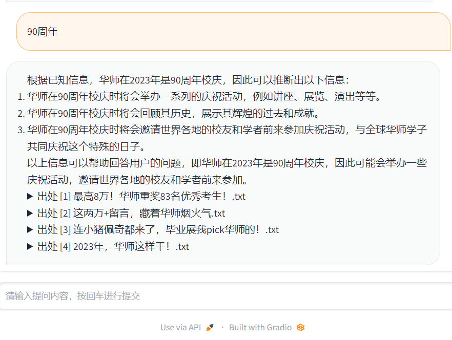
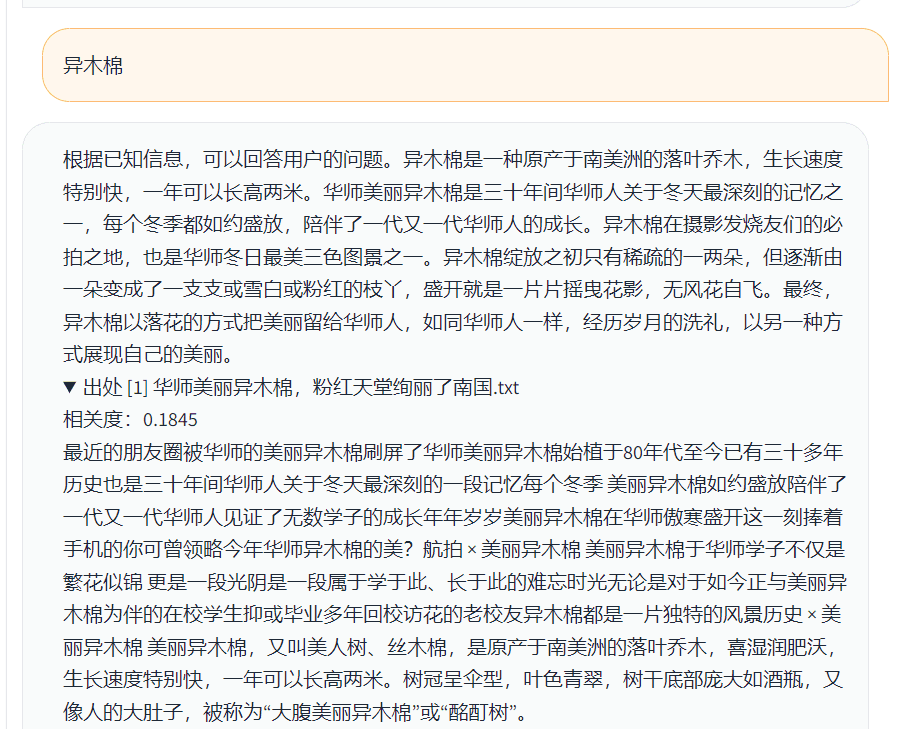

# 介绍

## 怎么用？
### step1
按照原仓库配置环境，可以见[安装指南](https://github.com/imClumsyPanda/langchain-ChatGLM/blob/master/docs/INSTALL.md)
### step2
- 准备自己知识库，也就是很多txt文件组成的一个文件夹，新建一个data文件夹，把知识库文件夹放进去，例如`data/SCNU_KB_v4`
- 激活环境，然后 执行 `python scnu_cli_demo.py`，然后提示输入知识库，就输入`data/SCNU_KB_v4`，这一步是创建向量库   
- 然后再vectorstore里面找到最新的那个向量库文件夹，默认名字应该是faiss开头很长的，改名为SCNU_KB_v4，方便后面使用   
### step3
执行`python scnu_webui.py`，启动webui

## 说明
1. 尽可能简化了UI和很多功能，只做简单的QA机器人
2. 主要是修改四个文件`scnu_cli_demo.py`涉及向量库的构建， `scnu_webui.py`涉及页面展示，  `chains\scnu_local_doc_qa.py`主要是QA行为， `configs\scnu_model_config.py`是参数配置，具体可以自行修改
3. 加入了自己爬取的知识库，来源是学校官方公众号《晚安华师》2014年-2023年5月的所有文章内容，2400篇，仅学术交流自用，爬虫参考[另一个仓库](https://github.com/bansky-cl/scnu_wechat_articles_spider)
4. 采用的LLM-backbone是chatglm-6b的一个int4量化版本，没有微调，因为微调数据不够而且对话能力变差，部署再一块2080ti 11G的wsl-ubuntu系统上，使用的时候显存在8-9G浮动，效果一般

## 效果图
### webui页面

### 提问'90周年'

### 提问 '异木棉'

### 提问'鳄雀鳝'

